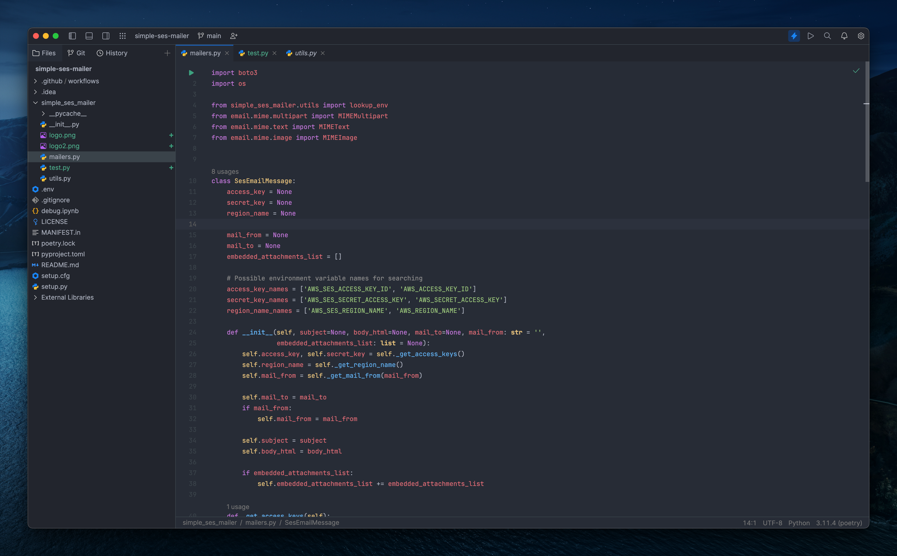
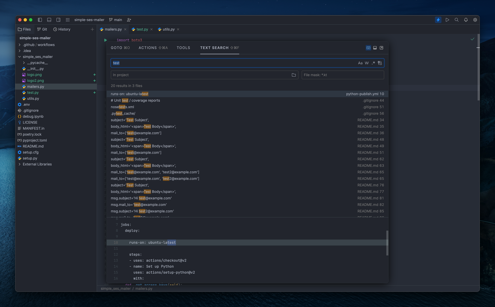

# Jetbrains Fleet One Dark Theme
  
This is a fork of the [sectasy0/fleet_one_dark](https://github.com/sectasy0/fleet_one_dark) with changed colors for maximum compliance with [IntelliJ One Dark theme](https://plugins.jetbrains.com/plugin/11938-one-dark-theme)


## Preview



## Installation

To install the One Dark color scheme in JetBrains Fleet, follow these steps:

1. Download the [`one-dark.json`](https://raw.githubusercontent.com/rez0n/fleet-one-dark-theme/master/one-dark.json) file from this repository.
2. Put this file inside `C:\Users\<your_username>\.fleet\themes\`
3. Open/restart JetBrains Fleet.
4. Go to Settings > Themes and pick `OneDark` from the list
5. Enjoy your colors!

```
curl -o ~/.fleet/themes/one-dark.json https://raw.githubusercontent.com/rez0n/fleet-one-dark-theme/master/one-dark.json
```

## License
This color scheme is licensed under the MIT License. You are free to use, modify, and distribute this theme as you see fit.

Enjoy coding with the One Dark color scheme!
